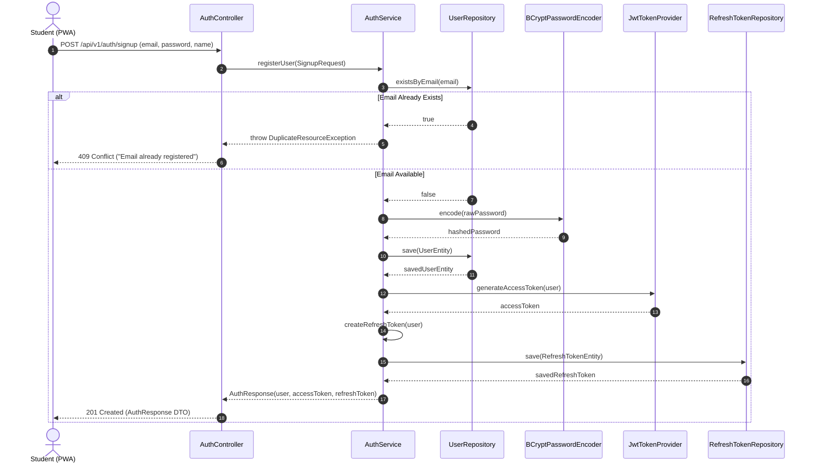
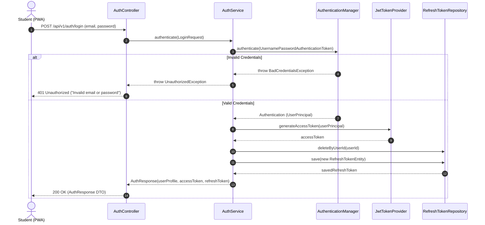
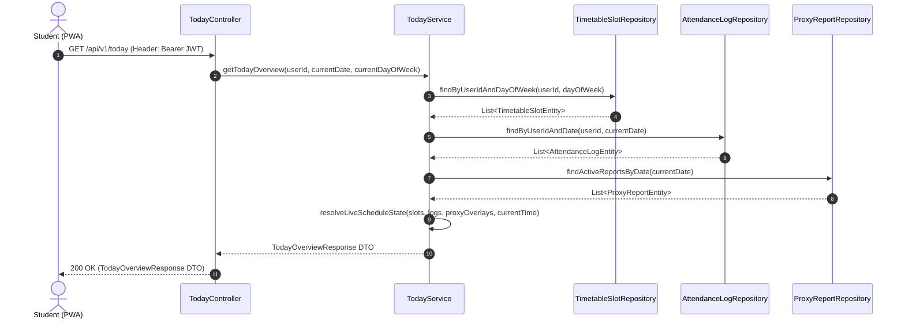
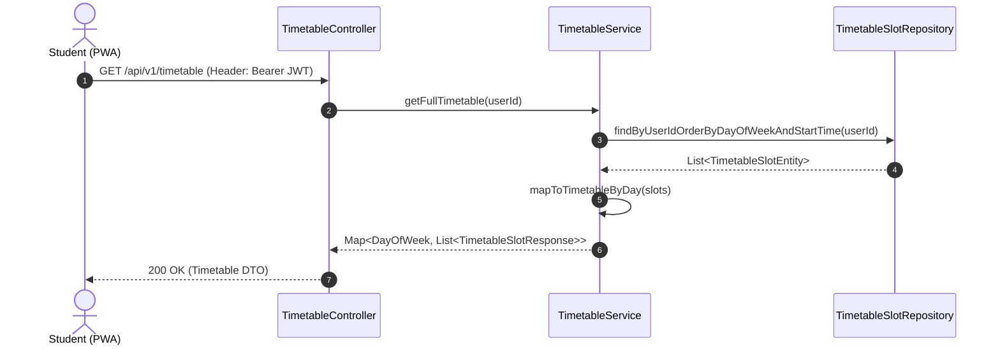
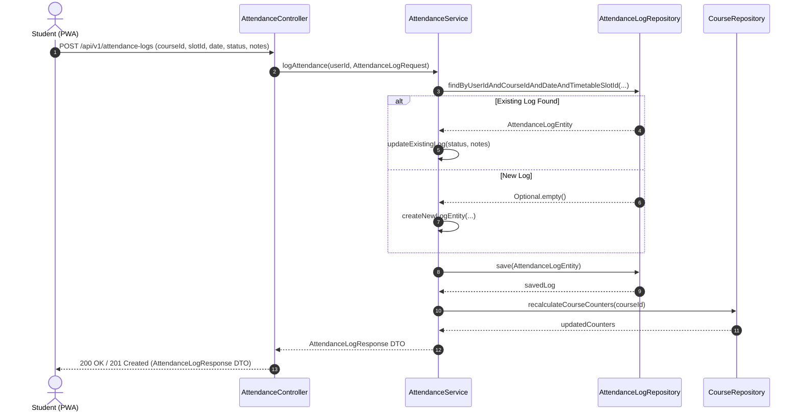
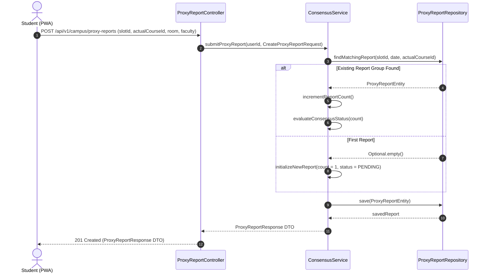
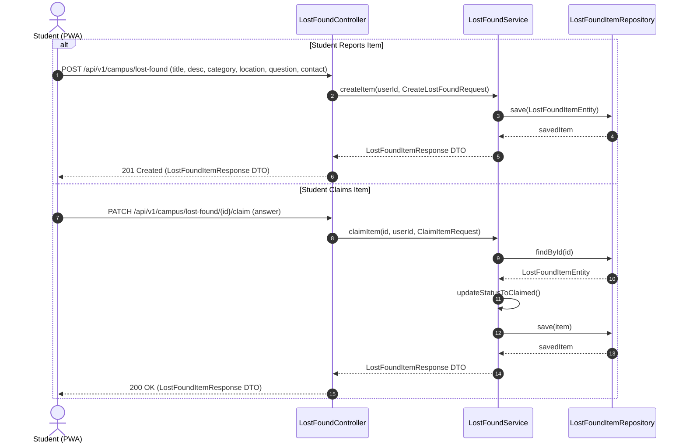

# BACKEND.md — KAIRO Backend Architecture Specification

Version: 1.0  
Status: Active — Implementation Ready  
Target Platform: Java 21 LTS / Spring Boot 3.4.x / PostgreSQL 16  
Companion documents: `AGENTS.md`, `PRODUCT.md`, `DECISIONS.md` (ADR-020), `DATABASE.md`, `API.md`

---

## 1. Architectural Overview

KAIRO's backend is a high-performance, stateless, domain-driven REST API built using **Java 21 LTS** and **Spring Boot 3.4.x**. The backend acts as the authoritative source of truth for all business logic, consensus calculation, authorization, and persistence (`AGENTS.md` §4.1).

### 1.1 Core Principles
1. **Stateless & Scalable**: Authentication uses short-lived JWT access tokens with database-managed refresh tokens. No HTTP server sessions are maintained.
2. **Domain-Driven Isolation**: Business logic resides strictly within Service layers—never in Controllers or UI components.
3. **Repository Pattern**: Data access is decoupled via Spring Data JPA interfaces.
4. **Strict DTO Encapsulation**: Internal database entities are never exposed directly to external clients. All input/output crosses API boundaries via validated DTOs.
5. **Zero-Trust Community Consensus**: Community reports (proxy reports, lost items) are evaluated purely on the backend according to consensus threshold rules (`AGENTS.md` §7).

---

## 2. Recommended Package & Project Structure

The project follows a standard modular Spring Boot architecture:

```
com.kairo.backend/
├── KairoBackendApplication.java
├── config/
│   ├── CorsConfig.java
│   ├── JpaAuditingConfig.java
│   └── SecurityConfig.java
├── controller/
│   ├── AuthController.java
│   ├── UserController.java
│   ├── CourseController.java
│   ├── TimetableController.java
│   ├── AttendanceController.java
│   ├── ProxyReportController.java
│   └── LostFoundController.java
├── service/
│   ├── AuthService.java
│   ├── UserService.java
│   ├── CourseService.java
│   ├── TimetableService.java
│   ├── AttendanceService.java
│   ├── ConsensusService.java
│   └── LostFoundService.java
├── repository/
│   ├── UserRepository.java
│   ├── RefreshTokenRepository.java
│   ├── CourseRepository.java
│   ├── EnrollmentRepository.java
│   ├── TimetableSlotRepository.java
│   ├── OfficialBaselineRepository.java
│   ├── AttendanceLogRepository.java
│   ├── ProxyReportRepository.java
│   └── LostFoundItemRepository.java
├── entity/
│   ├── BaseAuditEntity.java
│   ├── UserEntity.java
│   ├── UserRole.java
│   ├── RefreshTokenEntity.java
│   ├── AcademicTermEntity.java
│   ├── CourseEntity.java
│   ├── EnrollmentEntity.java
│   ├── TimetableSlotEntity.java
│   ├── OfficialBaselineEntity.java
│   ├── AttendanceLogEntity.java
│   ├── ProxyReportEntity.java
│   └── LostFoundItemEntity.java
├── dto/
│   ├── request/
│   │   ├── SignupRequest.java
│   │   ├── LoginRequest.java
│   │   ├── RefreshTokenRequest.java
│   │   ├── UpdateProfileRequest.java
│   │   ├── CreateCourseRequest.java
│   │   ├── AttendanceLogRequest.java
│   │   ├── CreateProxyReportRequest.java
│   │   ├── CreateLostFoundRequest.java
│   │   └── ClaimItemRequest.java
│   └── response/
│       ├── AuthResponse.java
│       ├── UserProfileResponse.java
│       ├── TodayOverviewResponse.java
│       ├── TimetableSlotResponse.java
│       ├── CourseSummaryResponse.java
│       ├── AttendanceLogResponse.java
│       ├── ProxyReportResponse.java
│       ├── LostFoundItemResponse.java
│       └── ApiErrorResponse.java
├── mapper/
│   ├── UserMapper.java
│   ├── CourseMapper.java
│   ├── TimetableMapper.java
│   ├── AttendanceMapper.java
│   ├── ProxyReportMapper.java
│   └── LostFoundMapper.java
├── security/
│   ├── JwtTokenProvider.java
│   ├── JwtAuthenticationFilter.java
│   ├── UserPrincipal.java
│   ├── CustomUserDetailsService.java
│   └── JwtAuthenticationEntryPoint.java
├── exception/
│   ├── GlobalExceptionHandler.java
│   ├── ResourceNotFoundException.java
│   ├── UnauthorizedException.java
│   ├── DuplicateResourceException.java
│   └── InvalidOperationException.java
└── validation/
    ├── ValidTimeSlot.java
    └── ValidTimeSlotValidator.java
```

### 2.1 Package Responsibility Justification
- `controller/`: REST API boundary. Annotates methods with Spring Web MVC (`@RestController`, `@GetMapping`, `@PostMapping`), validates DTOs (`@Valid`), and delegates immediately to services.
- `service/`: Encapsulates all transaction boundaries (`@Transactional`), attendance estimations, threshold calculations, and state transition logic.
- `repository/`: Spring Data JPA interfaces extending `JpaRepository<T, ID>` with custom JPQL queries.
- `entity/`: Database domain entities mapping directly to PostgreSQL 3NF tables using JPA/Hibernate annotations.
- `dto/`: Immutable data containers (using Java 21 `record` types where appropriate) defining API payload contracts.
- `mapper/`: Converts domain entities to response DTOs and request DTOs to entities.
- `security/`: Spring Security 6 filter chain, JWT validation, UserDetails implementation, and password hashing (`BCryptPasswordEncoder`).
- `exception/`: `@RestControllerAdvice` converting application exceptions to standard HTTP error responses (RFC 7807).

---

## 3. Authentication & Security Architecture

KAIRO uses a stateless **JWT (JSON Web Token)** access token model paired with database-backed **Refresh Tokens**.

```
Client (PWA)                     Spring Boot Backend                   PostgreSQL DB
    │                                     │                                 │
    │─── 1. POST /api/v1/auth/login ─────>│                                 │
    │                                     │─── 2. Validate Credentials ────>│
    │                                     │<─── User Entity + Hash ─────────│
    │                                     │
    │                                     │─── 3. Generate Access JWT & ───>│
    │                                     │      Save Refresh Token         │
    │<── 4. 200 OK (JWT + RefreshToken) ──│                                 │
    │                                     │                                 │
    │─── 5. GET /api/v1/today ───────────>│                                 │
    │      (Bearer <Access JWT>)          │─── 6. Validate Signature/Expiry │
    │<── 6. 200 OK (Today Overview) ──────│                                 │
```

### 3.1 Token Strategy
- **Access Token**: HMAC-SHA256 signed JWT. Expiration: **15 minutes**. Contains `sub` (User ID), `email`, and `roles`.
- **Refresh Token**: Cryptographically secure UUID string stored in the `refresh_tokens` database table. Expiration: **7 days**. Supports revocation on logout or security invalidation.
- **Password Hashing**: BCrypt with strength factor `12`.

### 3.2 Security Filter Chain Configuration
- Disabled Session Management (`SessionCreationPolicy.STATELESS`).
- Enabled CORS with explicit origin whitelist.
- Disabled CSRF (not required for stateless bearer JWT APIs).
- Public Endpoints:
  - `POST /api/v1/auth/signup`
  - `POST /api/v1/auth/login`
  - `POST /api/v1/auth/refresh`
  - `/actuator/health`
- Authenticated Endpoints: All other `/api/v1/**` endpoints require valid `Bearer` JWT authorization.

---

## 4. Sequence Diagrams for Core Flows

### 4.1 Signup Flow


### 4.2 Login Flow


### 4.3 Load Today Screen Flow


### 4.4 Load Timetable Flow


### 4.5 Mark / Edit Attendance Flow


### 4.6 Report Schedule Change (Proxy Report) Flow


### 4.7 Report / Claim Lost & Found Item Flow


---

## 5. Global Exception Handling & Error Standard

All exceptions thrown across the application are intercepted by `GlobalExceptionHandler` (`@RestControllerAdvice`) and converted into standardized JSON error responses:

```json
{
  "timestamp": "2026-07-21T19:50:00Z",
  "status": 404,
  "error": "Not Found",
  "message": "Course with ID 'cs101-uuid' not found.",
  "path": "/api/v1/courses/cs101-uuid"
}
```

| Exception Type | HTTP Status | Description |
|----------------|-------------|-------------|
| `MethodArgumentNotValidException` | 400 Bad Request | Request DTO validation failed (`@NotNull`, `@Email`, etc.) |
| `UnauthorizedException` | 401 Unauthorized | Missing, expired, or invalid JWT access token |
| `AccessDeniedException` | 403 Forbidden | User lacks necessary role or resource ownership |
| `ResourceNotFoundException` | 404 Not Found | Requested entity ID does not exist in PostgreSQL |
| `DuplicateResourceException` | 409 Conflict | Unique constraint violation (e.g. duplicate email) |
| `InvalidOperationException` | 422 Unprocessable Entity | Business rule violation |
| `Exception` | 500 Internal Error | Unhandled server error |
