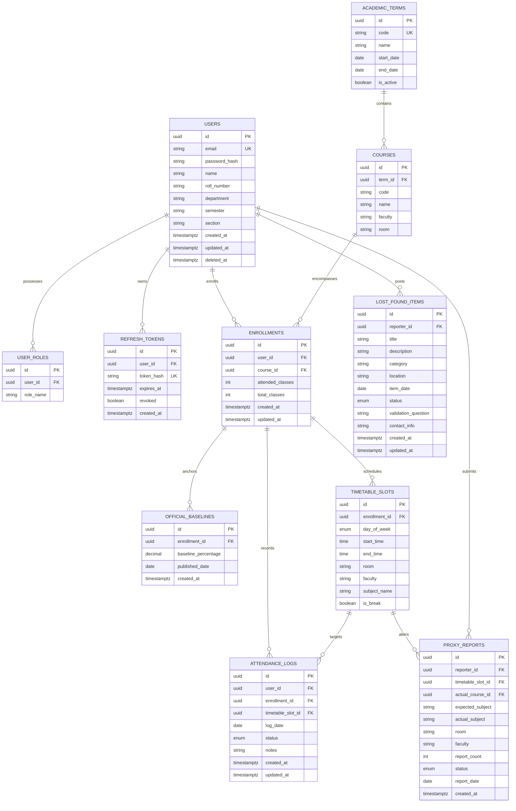

# DATABASE.md — KAIRO PostgreSQL 3NF Schema & ERD Specification

Version: 1.0  
Status: Active — Implementation Ready  
Target Engine: PostgreSQL 16+  
Companion documents: `AGENTS.md`, `PRODUCT.md`, `DECISIONS.md` (ADR-020), `BACKEND.md`, `API.md`

---

## 1. Entity & Domain Relationship Overview

The database design strictly enforces Third Normal Form (3NF), separating core global domain catalog entities from student-specific instances, audit logs, community consensus reports, and security credentials.

### 1.1 Core Entities & Ownership Rules
- **`users`**: Represents a student's core identity, authentication credentials (BCrypt hash), and profile details.
- **`user_roles`**: Weak entity mapping 1-to-Many roles (`ROLE_STUDENT`, `ROLE_ADMIN`) to a user.
- **`refresh_tokens`**: Stores active hashed cryptographic JWT refresh tokens per user session.
- **`academic_terms`**: Global academic term/semester metadata (e.g. "Fall 2026", "Semester 5").
- **`courses`**: Catalog of academic courses (`CS101`, `Java Programming`) offered within an academic term.
- **`enrollments`**: Junction entity modeling a student's enrollment in a course. Tracks calculated counters (`attended_classes`, `total_classes`) for fast 5-second initial load performance (`AGENTS.md` §2.2).
- **`official_attendance_baselines`**: Historical published ERP baseline percentages (`80.0%` as of `2026-07-15`) anchored to an enrollment for estimation calculations (`DECISIONS.md` ADR-019).
- **`timetable_slots`**: Weekly scheduled class slots (Day, Start Time, End Time, Room, Faculty) linked to a student's enrollment.
- **`attendance_logs`**: Chronological log of individual period attendance records marked by the student.
- **`proxy_reports`**: Zero-trust community-submitted schedule change reports (`AGENTS.md` §7). Evaluates status (`Pending`, `Likely`, `Verified`, `Auto Accepted`) based on aggregate report counts.
- **`lost_found_items`**: Campus Lost & Found posts (`Lost`, `Found`, `Claimed`) with validation questions.

---

## 2. Entity Relationship Diagram (ERD)



---

## 3. PostgreSQL Complete DDL Schema Script

```sql
-- KAIRO Production Database DDL Schema
-- Engine: PostgreSQL 16+

CREATE EXTENSION IF NOT EXISTS "uuid-ossp";

-- =============================================================================
-- ENUM TYPES
-- =============================================================================

CREATE TYPE user_role_enum AS ENUM ('ROLE_STUDENT', 'ROLE_ADMIN');
CREATE TYPE day_of_week_enum AS ENUM ('MON', 'TUE', 'WED', 'THU', 'FRI', 'SAT', 'SUN');
CREATE TYPE attendance_status_enum AS ENUM ('PRESENT', 'ABSENT');
CREATE TYPE consensus_status_enum AS ENUM ('PENDING', 'LIKELY', 'VERIFIED', 'AUTO_ACCEPTED');
CREATE TYPE lost_found_status_enum AS ENUM ('LOST', 'FOUND', 'CLAIMED');

-- =============================================================================
-- TABLES
-- =============================================================================

-- 1. USERS TABLE
CREATE TABLE users (
    id UUID PRIMARY KEY DEFAULT uuid_generate_v4(),
    email VARCHAR(255) NOT NULL UNIQUE,
    password_hash VARCHAR(255) NOT NULL,
    name VARCHAR(100) NOT NULL,
    roll_number VARCHAR(50),
    department VARCHAR(100),
    semester VARCHAR(50),
    section VARCHAR(50),
    created_at TIMESTAMPTZ NOT NULL DEFAULT CURRENT_TIMESTAMP,
    updated_at TIMESTAMPTZ NOT NULL DEFAULT CURRENT_TIMESTAMP,
    deleted_at TIMESTAMPTZ
);

-- 2. USER ROLES TABLE
CREATE TABLE user_roles (
    id UUID PRIMARY KEY DEFAULT uuid_generate_v4(),
    user_id UUID NOT NULL REFERENCES users(id) ON DELETE CASCADE,
    role_name user_role_enum NOT NULL DEFAULT 'ROLE_STUDENT',
    CONSTRAINT uk_user_role UNIQUE (user_id, role_name)
);

-- 3. REFRESH TOKENS TABLE
CREATE TABLE refresh_tokens (
    id UUID PRIMARY KEY DEFAULT uuid_generate_v4(),
    user_id UUID NOT NULL REFERENCES users(id) ON DELETE CASCADE,
    token_hash VARCHAR(255) NOT NULL UNIQUE,
    expires_at TIMESTAMPTZ NOT NULL,
    revoked BOOLEAN NOT NULL DEFAULT FALSE,
    created_at TIMESTAMPTZ NOT NULL DEFAULT CURRENT_TIMESTAMP
);

-- 4. ACADEMIC TERMS TABLE
CREATE TABLE academic_terms (
    id UUID PRIMARY KEY DEFAULT uuid_generate_v4(),
    code VARCHAR(50) NOT NULL UNIQUE,
    name VARCHAR(100) NOT NULL,
    start_date DATE NOT NULL,
    end_date DATE NOT NULL,
    is_active BOOLEAN NOT NULL DEFAULT TRUE,
    created_at TIMESTAMPTZ NOT NULL DEFAULT CURRENT_TIMESTAMP,
    updated_at TIMESTAMPTZ NOT NULL DEFAULT CURRENT_TIMESTAMP,
    deleted_at TIMESTAMPTZ,
    CONSTRAINT chk_term_dates CHECK (start_date <= end_date)
);

-- 5. COURSES TABLE
CREATE TABLE courses (
    id UUID PRIMARY KEY DEFAULT uuid_generate_v4(),
    term_id UUID NOT NULL REFERENCES academic_terms(id) ON DELETE RESTRICT,
    code VARCHAR(50) NOT NULL,
    name VARCHAR(150) NOT NULL,
    faculty VARCHAR(100),
    room VARCHAR(50),
    created_at TIMESTAMPTZ NOT NULL DEFAULT CURRENT_TIMESTAMP,
    updated_at TIMESTAMPTZ NOT NULL DEFAULT CURRENT_TIMESTAMP,
    deleted_at TIMESTAMPTZ,
    CONSTRAINT uk_term_course_code UNIQUE (term_id, code)
);

-- 6. ENROLLMENTS TABLE
CREATE TABLE enrollments (
    id UUID PRIMARY KEY DEFAULT uuid_generate_v4(),
    user_id UUID NOT NULL REFERENCES users(id) ON DELETE CASCADE,
    course_id UUID NOT NULL REFERENCES courses(id) ON DELETE RESTRICT,
    attended_classes INT NOT NULL DEFAULT 0,
    total_classes INT NOT NULL DEFAULT 0,
    created_at TIMESTAMPTZ NOT NULL DEFAULT CURRENT_TIMESTAMP,
    updated_at TIMESTAMPTZ NOT NULL DEFAULT CURRENT_TIMESTAMP,
    deleted_at TIMESTAMPTZ,
    CONSTRAINT uk_user_course UNIQUE (user_id, course_id),
    CONSTRAINT chk_attendance_counters CHECK (attended_classes >= 0 AND total_classes >= 0 AND attended_classes <= total_classes)
);

-- 7. OFFICIAL BASELINES TABLE
CREATE TABLE official_baselines (
    id UUID PRIMARY KEY DEFAULT uuid_generate_v4(),
    enrollment_id UUID NOT NULL REFERENCES enrollments(id) ON DELETE CASCADE,
    baseline_percentage NUMERIC(5,2) NOT NULL,
    published_date DATE NOT NULL,
    created_at TIMESTAMPTZ NOT NULL DEFAULT CURRENT_TIMESTAMP,
    CONSTRAINT chk_baseline_pct CHECK (baseline_percentage >= 0.00 AND baseline_percentage <= 100.00)
);

-- 8. TIMETABLE SLOTS TABLE
CREATE TABLE timetable_slots (
    id UUID PRIMARY KEY DEFAULT uuid_generate_v4(),
    enrollment_id UUID REFERENCES enrollments(id) ON DELETE CASCADE,
    day_of_week day_of_week_enum NOT NULL,
    start_time TIME NOT NULL,
    end_time TIME NOT NULL,
    room VARCHAR(50),
    faculty VARCHAR(100),
    subject_name VARCHAR(150) NOT NULL,
    is_break BOOLEAN NOT NULL DEFAULT FALSE,
    created_at TIMESTAMPTZ NOT NULL DEFAULT CURRENT_TIMESTAMP,
    updated_at TIMESTAMPTZ NOT NULL DEFAULT CURRENT_TIMESTAMP,
    deleted_at TIMESTAMPTZ,
    CONSTRAINT chk_slot_times CHECK (start_time < end_time)
);

-- 9. ATTENDANCE LOGS TABLE
CREATE TABLE attendance_logs (
    id UUID PRIMARY KEY DEFAULT uuid_generate_v4(),
    user_id UUID NOT NULL REFERENCES users(id) ON DELETE CASCADE,
    enrollment_id UUID NOT NULL REFERENCES enrollments(id) ON DELETE CASCADE,
    timetable_slot_id UUID REFERENCES timetable_slots(id) ON DELETE SET NULL,
    log_date DATE NOT NULL,
    status attendance_status_enum NOT NULL,
    notes TEXT,
    created_at TIMESTAMPTZ NOT NULL DEFAULT CURRENT_TIMESTAMP,
    updated_at TIMESTAMPTZ NOT NULL DEFAULT CURRENT_TIMESTAMP,
    deleted_at TIMESTAMPTZ,
    CONSTRAINT uk_user_slot_date UNIQUE (user_id, timetable_slot_id, log_date)
);

-- 10. PROXY REPORTS TABLE
CREATE TABLE proxy_reports (
    id UUID PRIMARY KEY DEFAULT uuid_generate_v4(),
    reporter_id UUID NOT NULL REFERENCES users(id) ON DELETE CASCADE,
    timetable_slot_id UUID NOT NULL REFERENCES timetable_slots(id) ON DELETE CASCADE,
    actual_course_id UUID REFERENCES courses(id) ON DELETE SET NULL,
    expected_subject VARCHAR(150) NOT NULL,
    actual_subject VARCHAR(150) NOT NULL,
    room VARCHAR(50),
    faculty VARCHAR(100),
    report_count INT NOT NULL DEFAULT 1,
    status consensus_status_enum NOT NULL DEFAULT 'PENDING',
    report_date DATE NOT NULL,
    created_at TIMESTAMPTZ NOT NULL DEFAULT CURRENT_TIMESTAMP,
    updated_at TIMESTAMPTZ NOT NULL DEFAULT CURRENT_TIMESTAMP,
    CONSTRAINT chk_report_count CHECK (report_count >= 1)
);

-- 11. LOST FOUND ITEMS TABLE
CREATE TABLE lost_found_items (
    id UUID PRIMARY KEY DEFAULT uuid_generate_v4(),
    reporter_id UUID NOT NULL REFERENCES users(id) ON DELETE CASCADE,
    title VARCHAR(150) NOT NULL,
    description TEXT NOT NULL,
    category VARCHAR(100) NOT NULL,
    location VARCHAR(150) NOT NULL,
    item_date DATE NOT NULL,
    status lost_found_status_enum NOT NULL DEFAULT 'LOST',
    validation_question TEXT,
    contact_info VARCHAR(150) NOT NULL,
    created_at TIMESTAMPTZ NOT NULL DEFAULT CURRENT_TIMESTAMP,
    updated_at TIMESTAMPTZ NOT NULL DEFAULT CURRENT_TIMESTAMP,
    deleted_at TIMESTAMPTZ
);

-- =============================================================================
-- INDEXES FOR HIGH PERFORMANCE
-- =============================================================================

CREATE INDEX idx_users_email ON users(email) WHERE deleted_at IS NULL;
CREATE INDEX idx_refresh_tokens_user ON refresh_tokens(user_id) WHERE revoked = FALSE;
CREATE INDEX idx_enrollments_user ON enrollments(user_id) WHERE deleted_at IS NULL;
CREATE INDEX idx_timetable_slots_enrollment ON timetable_slots(enrollment_id, day_of_week) WHERE deleted_at IS NULL;
CREATE INDEX idx_attendance_logs_user_date ON attendance_logs(user_id, log_date) WHERE deleted_at IS NULL;
CREATE INDEX idx_attendance_logs_enrollment ON attendance_logs(enrollment_id) WHERE deleted_at IS NULL;
CREATE INDEX idx_proxy_reports_date_slot ON proxy_reports(report_date, timetable_slot_id);
CREATE INDEX idx_lost_found_date_status ON lost_found_items(item_date, status) WHERE deleted_at IS NULL;
